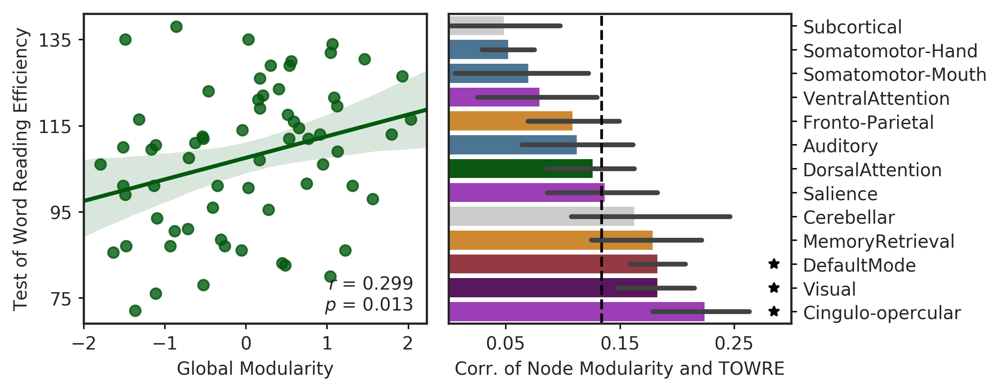
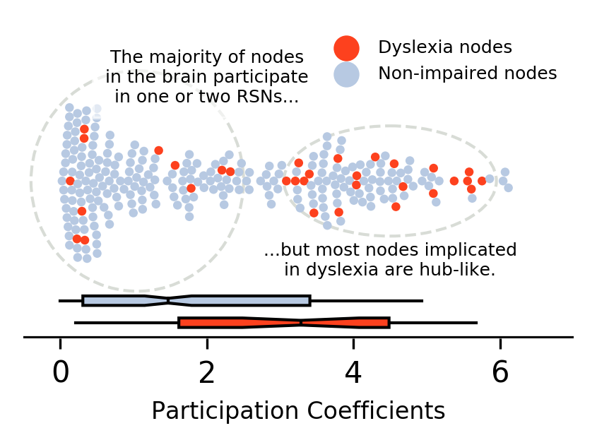

## Figures and Data for "Applying a network framework to the study of reading and dyslexia"
### Stephen Bailey, Katherine Aboud, Tin Nguyen and Laurie Cutting

This repository contains supplementary data and details for the analyses presented in this paper. Data is organized into folders based on the figures / analysis performed. Many of the analyses are based on publicly available datasets, the details of which can be found below. 

### Fig1_Yeo-to-NeuroSynth

- **NeuroSynth_reading_pXXX_z_FDR_0.01.nii.gz**: Forward-inference (pAgF) and reverse-inference (pFgA) maps for the term "reading". Downloaded Oct. 2017 from [NeuroSynth](http://neurosynth.org/analyses/terms/reading/).  
- **Yeo_7Networks_2mm_LiberalMask_reg2MNI.nii.gz**: Cortical parcellation estimated in [Yeo et al., 2011](https://www.ncbi.nlm.nih.gov/pmc/articles/PMC3174820/). The "Liberal Mask" volume (available [here](https://surfer.nmr.mgh.harvard.edu/fswiki/CorticalParcellation_Yeo2011)) was transformed from 1mm "fsaverage" space to FSL's 2mm MNI 152 standard space template using *flirt*. 
- **Intersection_reading_pXXX_Yeo7.nii.gz**: Yeo 7-network parcellation, masked by the corresponding inference map from NeuroSynth. File is in MNI 152 2mm space.

### Fig2_Network-Predicts-Reading

- Modularity arrays
- Demographic / reading data

### Fig3_Dyslexia-vs-Hubness

- **Bailey2017_ROI-by-DYS.csv**: Node list including hub measures and whether it was implicated in dyslexia. Base file (264 nodes and network measures) is drawn from [Table S2](https://www.ncbi.nlm.nih.gov/pmc/articles/PMC3838673/#SMtitle) of [Evidence for hubs in human functional brain networks](https://dx.doi.org/10.1016%2Fj.neuron.2013.07.035)
- **Dyslexia_Meta-Analytic-Results.xlsx**: Spreadsheet containing the original tables from the three meta-analyses used in the study. One study per sheet. Includes:
	- Tables 5 and 7 of [Maisog et al., 2008](http://onlinelibrary.wiley.com/doi/10.1196/annals.1416.024/full)
	- Table 2 of [Richlan et al., 2009](http://onlinelibrary.wiley.com/doi/10.1002/hbm.20752/full)
	- Table 2 from [Paulesu et al., 2013](https://www.ncbi.nlm.nih.gov/pmc/articles/PMC4227573/))
